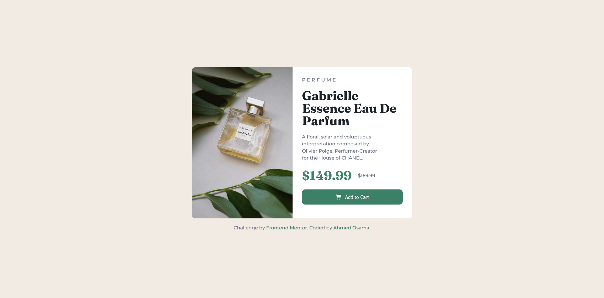

# Frontend Mentor - Product preview card component solution

This is a solution to the [Product preview card component challenge on Frontend Mentor](https://www.frontendmentor.io/challenges/product-preview-card-component-GO7UmttRfa). Frontend Mentor challenges help you improve your coding skills by building realistic projects.

## Table of contents

- [Overview](#overview)
  - [The challenge](#the-challenge)
  - [Screenshot](#screenshot)
  - [Links](#links)
- [My process](#my-process)
  - [Built with](#built-with)
  - [What I learned](#what-i-learned)
  - [Continued development](#continued-development)
  - [Useful resources](#useful-resources)
- [Author](#author)

## Overview

### The challenge

Users should be able to:

- View the optimal layout depending on their device's screen size
- See hover and focus states for interactive elements

### Screenshot



### Links

- Solution URL: [Product preview card](https://www.frontendmentor.io/solutions/mobile-first-flexible-product-preview-0n7_tym_Yd)
- Live Site URL: [Product preview card](https://ahmed-osama99.github.io/Product-Preview-Card/)

## My process

### Built with

- Semantic HTML5 markup
- CSS custom properties
- Flexbox
- CSS Grid
- Mobile-first workflow
- clamp() method

### What I learned

```html
<picture>
  <source
    media="(min-width: 786px)"
    srcset="./images/image-product-desktop.jpg"
  />
  
</picture>
```

```css
@media (min-width: 768px) {
  html {
    font-size: clamp(1.125rem, 1.5vw + 0.75rem, 1.25rem);
  }
}
```

### Continued development

- Focus on responsive font sizes , layout , images and clamp() method

### Useful resources

- [web.dev](https://web.dev/learn/design/responsive-images) - This helped me for handle images. I really liked this pattern and will use it going forward.
- [Kevin Powell](https://youtu.be/_-aDOAMmDHI?si=tWFelxPam_cDWx33) - This is an amazing Youtube channel which helped me finally understand em vs rem. I'd recommend it to anyone still learning any concept in css.

## Author

- Frontend Mentor - [@Ahmed-Osama99](https://www.frontendmentor.io/profile/Ahmed-Osama99)
- Codepen - [@ahmed-osama99](https://codepen.io/ahmed-osama99)

